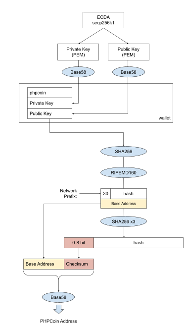
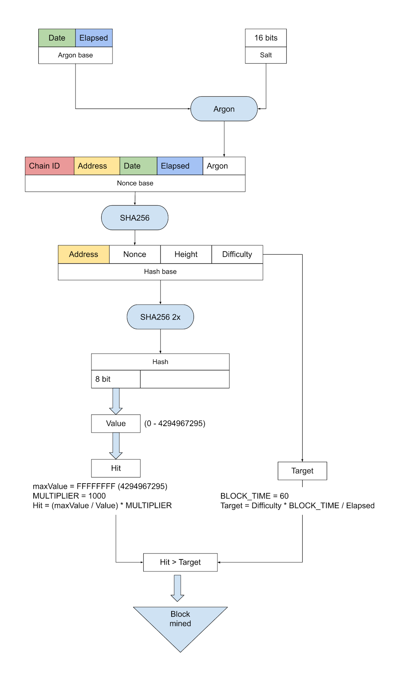
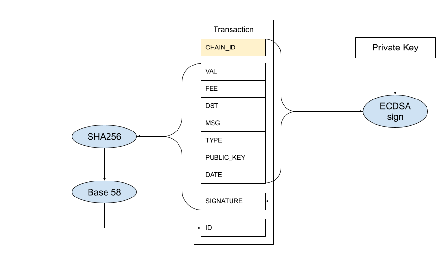
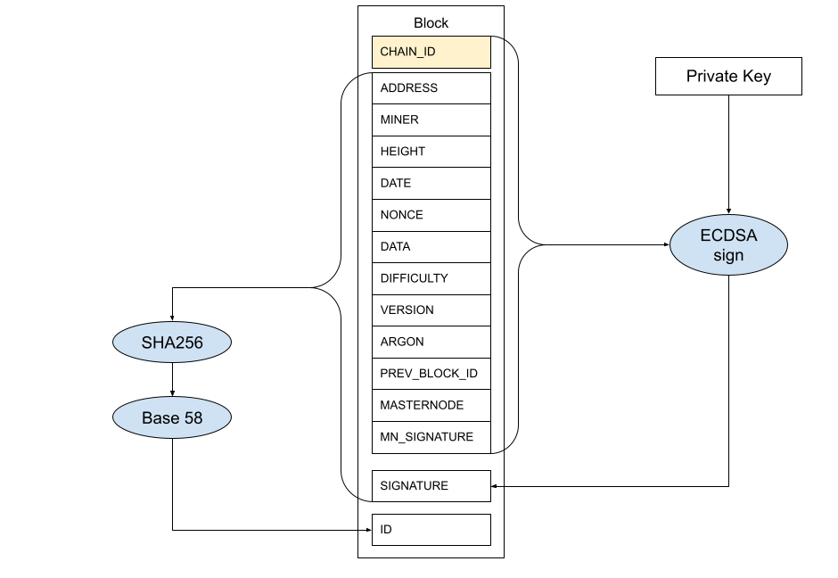

[PHPCoin Docs](../) > [White Paper](./) > PHPCoin White Paper

[Up](README.md) | [Table of Contents](../README.md)

---

# PHPCoin Whitepaper

**Version 1.6**

**Date: 2023-02-08**

**http://phpcoin.net**

## Changes

| Date       | Version | Changes                                                     |
|------------|---------|-------------------------------------------------------------|
| 07.05.2021 | 1.0     | - Initial version                                           |
| 22.09.2021 | 1.1     | - Added new images                                          |
| 27.09.2021 | 1.2     | - Updated images                                            |
| 23.02.2022 | 1.3     | - Added masternode concept                                  |
| 04.11.2022 | 1.4     | - Added sections with decentralized apps and Smart Contracts |
| 22.11.2022 | 1.5     | - Update image for miner (added Chain ID)                   |
| 08.02.2023 | 1.6     | - Corrected some points, added staking and swap sections    |

## Introduction

In the world of many different crypto coins which are mostly copy-paste (fork) there are a small number of them written in different languages than c++. With evolving blockchain technologies it has become easier to understand the philosophy behind it and adapt to other programming languages. That's how phpcoin was born.

Decision to implement blockchain in php was chosen because it is still one of the most popular and easily understandable programming languages in the world but not so much established in the crypto world.

Idea of phpcoin is to present basic crypto philosophy to a broader audience of developers for further improvements and focusing on utilizing blockchain technology for web services, rather than just earning some cryptocurrency.

Also the goal of phpcoin is to solve some of the proven and known cons of existing blockchains and cryptocurrencies.

### Disclaimer

Phpcoin is not completely written from scratch. Its basic idea comes from the Arionum coin built and established in 2018, their experience and code which gives an easy understable concept of blockchain philosophy.

Php is not just a fork of Arionum, it is built on their base, modified and adapted to meet php basic blockchain philosophy, and add more unique features to it.

Phpcoin will stay open source, encouraging other developers to continue evolving on top of its code, in such a way promoting php as a new blockchain underlying technology.

### Why another coin?

While many coins are just designed to build, gain interest, give fast profit to owners and exit as potential scam, phpcoin will tend to develop through a large developer community who can contribute to the project.

Also phpcoin is designed as some kind of "green" coin which is tend to solve issue of heavy mining algorithms by utilizing its own and unique elapsed proof of work (EPOW)

Phpcoin is built on the web based platform which is easily understandable to a wider number of developers. It explains basic blockchain principles and allows people to understand its full purpose not just for earning profit.

In that way phpcoin will implement decentralized apps and databases and smart contracts written fully in well known and popular language php.

## Blockchain

### Technology and structure

#### Node

Blockchain is organized through a distributed network of peers. Each peer is recognized as a node.

Node is the central unit in the network. It needs to be deployed on a server and available online. It is started in order to support the network and provide services. Node has a built in miner to mine coins in the background and earn revenue to its owners. Blockchain is stored in a database which is replicated on all nodes using propagation of block transactions.

By utilizing transactions different actions in the network can be distributed.

Node mining process is light and easy in order to not affect the operation of the node. If excessive mining occurs and a node becomes inoperative it can be blacklisted from other peers on the network.

Node can have many different functions which can be configured:

*   **Explorer** - node hosts full blockchain explorer
*   **Dapps** - special service of node who checks, propagates and pushes decentralized apps
*   **Miner** - node can be a standalone miner who mines new blocks in the background. Complete block reward goes to the node.
*   **Generator** - node can be configured as a service which accepts hashes from miners, validates them and adds blocks to blockchain.
*   **Admin** - if enabled allows web administration of node to owner
*   **Masternode** - if configured and activated receive part of block rewards

#### Miner

Miners are used to move blockchain.

They can be standalone, web or node miners.

*   **Standalone and web miners** are simple miners which allow users to easily earn coins with mining. In both cases users need to provide an address to which they will receive a reward for the mined block. Miner is connected to an associated node and block reward is split 90-10 % between miner and node.
*   **Node miner** is a service process on deployed nodes which mines and adds blocks. Complete block reward goes to it.

#### Wallet

Wallet is a service which allows users to manage their account. As opposed to other cryptocurrencies, PHPCoin each wallet holds only one address with private key and public key.

Wallet will serve as a mailbox for users where they can receive messages and notifications from future apps.

Also wallets can be standalone or web.

A standalone wallet is an application (cli or gui) which is installed on a user computer and connects to an associated node to perform wallet functions.

Wallet has its own account which can be encrypted to improve security.

Gui wallet also has an integrated standalone miner.

#### Web wallet

Every node on the network holds a full web wallet as a Decentralized app.

Users register and login with their private key and can access wallet and other services.

### Account

An account is a basic point of blockchain. It is used to identify objects (person, node) who will participate in blockchain functions.

Account is consist of three pieces of information which are securely connected and unique.

Account will be independent from the chain where it is used.

#### Private key

Private key is a unique generated key which represents ownership of an account. It is known only to the owner, and the owner's responsibility is to store it and keep it safe. Without a private key account holder can not access its funds or use blockchain functions. In case of loss of private key there is no possibility to restore the account.

Phpcoin web services and its apps will never try to read, know, store or use private keys and any deviation from that will be considered a security threat and will be highly discouraged.

Private key is only used to sign a message on the owner's side before sending further.

#### Public key

Public key is derived from private key, in an irreversible process. It is used to identify parts in blockchain transactions, to verify that they are really sent from intended account owners. Public key is free to show and share. If lost can be derived from a private key.

#### Address

Address is derived from the public key and is used to visually represent part in the process. It is shorter than a public key and also can be freely shown and shared.

#### Securing account

Each account is permanently stored in a blockchain database once a transaction is executed over them. Actually only address and public key is stored, while private key is only known to account holders.

When the address is first time generated, it is generated with empty balance so in order to use that address for login or for mining it needs to be secured, i.e. it must execute one outgoing transaction, in order to store its public key.

For that purpose some nodes in the network will provide faucet service which can donate some initial amount to an unsecured address by request.

This will help users to start mining, but on the other hand prevent malicious and excessive usage of accounts.

#### Faucet

Faucet is a service which will provide new users to get into the network and start mining.

Faucet will send some small amount of coin (0.01) to the entered address. In order to receive that reward address must not exist in the blockchain.

By receiving a reward address is recorded, but is insecure (without public key) until it does not perform one outgoing transaction of arbitrary amount. That transaction can be paid back to the faucet address as an example.

Faucet is served from a node which is configured for that purpose. Faucet obviously needs to have funds in its account in order to operate.

As an advanced version of faucet, a new Dapp named Verifier is implemented to allow faster and more automatic verification of an account.

### Blockchain consensys

Phpcoin blockchain tries to solve actual issues with traditional proof of work consensus (POW). As POW is often criticized as a very energy waste, PHP Coin utilizes its own lightweight version of POW, called EPOW - Elapsed Proof Of Work.

Basic principle of this algorithm is that valid hash is calculated for each miner in such a way that the more time elapsed from target block time it will be easier to mine the block.

#### Mining process

Miners generate a new block on the network.

In order to do that, miners get work from a connected node. That work contains the latest block info.

Then the miner goes into a loop and calculates his elapsed times from the last block.

To prove his work, the miner hashes the base string with argon and its address.

Based on its address it calculates hit value which is changed every second elapsed from last block time.

With a given difficulty for the next block which is calculated from node, miner calculates the target and when its hit value becomes higher than target it mines a block.

Target is not fixed, it is calculated from difficulty and is lower as time passes from the previous block. It is centered to be optimal to mine blocks for given block time.

After finding the hash, the miner sends it to the associated node. Node checks miner hash, and if it is validated, node adds a new block to blockchain. For that block beside mempool transactions node adds more reward transactions.

First one is a reward to the miner who submitted a targeted hash and second is reward to the node who added a block to blockchain. Third reward goes to the node on the network which wins that block as a masternode.

Another reward which is called stake goes to the account (address) which is the winner in that mechanism.

Amount for rewards are calculated from actual block reward, they are depending on block height, and are defined with a global rewards scheme.

#### Difficulty adjustment

Based on a simple formula that calculates the last 10 blocks, difficulty is calculated and adjusted for every block. If a block is found faster than block target time, difficulty is increased by 5%, otherwise it is decreased by 5%.

#### Transaction sign and validation

Every transaction which transfers some value between addresses needs to be signed by the sender private key. It can be a transaction signed by a miner or transaction signed within a wallet. In both cases a transaction is signed with a private key which is held only in possession of the owner.

#### Block sign and validation

Block which is generated in the process is signed with the generator's private key. When such a block is received on a network of peers it is validated with the generator's public key which is stored in block information. If a signature is valid, a block is added to the blockchain.

## Masternodes

### Masternode concept

Masternode is a special kind of node whose purpose is to make the network stable and provide different services. For its role will be rewarded in rounds for each block. By design and defined rewards scheme masternode rewards will be slowly increased as time passes by and hence reducing miners' role. Actions for masternode will be available in wallet and in gui wallet.

### Create masternode

To create a masternode user needs to create another wallet and address (masternode address). Then he needs to send collateral from his wallet to that address with a special transaction type (create masternode). Source wallet will be reduced by collateral amount which will be then locked on masternode address. Processing this transaction, a new entry will be created in the masternode table and propagated over the network. Validation of this transaction must check that the destination address is not already in the masternode list. When a new masternode is added to the list it will be first in order to receive the next reward.

If a user wants to spend collateral he needs to remove masternode. Only allowed transfer from masternode is the amount earned over collateral.

Collateral will be dynamic, i.e. its amount will depend og blockchain height. After collateral changes which are defined in the global rewards scheme, the owner must remove the masternode with old collateral and create new one with new collateral.

### Masternode work - Proof of service

Masternode must be running constantly in order to receive reward. It is performed in that way that masternode must create its own signature for every next block. If a signature is verified from other nodes on the network , the masternode is rewarded when it is his turn. If masternode is offline, not running, not synced or in any other way prevented from signing future blocks, it will not receive a reward. When masternode calculates its signature it propagates it to other nodes on the network. Other nodes validate signature and update entries in the masternode table.

### Masternode rewards

Masternodes are rewarded in rounds by principle first come first served. In each block will be calculated the masternode winner as the node which is oldest paid in the list with verified signature. In the masternode list there will be column win height i.e. block at which mn is last time paid. It is calculated from the block when the masternode receives the last reward and can be verified. Because only one masternode can be paid in one block, the win height will be unique. Reward transaction is created as a transaction to the masternode winner address which is in the masternode list active and with minimal win height and verified signature. Every other node will then verify this transaction. This transaction is created and signed by a node who adds a block ( generator or nodeminer). On other nodes reward transactions are processed, and the winner's masternode will be updated in the list with a new win height. Each masternode in each block will check his entry in the masternode list and calculate the signature for the next block. Then it will propagate his entry across the network. As an addition to the block, there is a new column masternode which will hold the masternode address of the winner in that block. Also there will be a masternode signature for verification. These columns will be also added to the block signature base. Other nodes when verifying the block will check the masternode address and signature and it will verify it.

Base for signature is public key and current block height

### Blacklisting masternode

There will be no need to blacklist it, because if masternode is not working, or in any way prevented from service, it will lose its reward. As soon as it becomes operative, masternode will start receiving rewards again.

### Delete masternode

By deleting masternode, the user removes his masternode from the list and releases collateral. Delete of masternode will be possible only if a certain number of blocks are passed from masternode creation or after collateral change. In that way it will ensure that each masternode must run some defined time in order to prevent abuse. Users need to send a collateral amount from the masternode address to another address. This is a new type of transaction. Source masternode wallet will be then reduced by collateral. Processing this transaction will cause masternode to be deleted from the list and propagated. By verifying transactions will be checked if source address is in the masternode list and check if passed a defined number of blocks from the collateral transaction. With this action collateral will be unlocked.

## Staking

Beside earning coins by mining, hosting node or masternode, each account on blockchain which meets some requirements can also earn part of block reward. Staking reward is depending on block height and is defined in a global rewards scheme.

The main principle for staking is that any address that has a minimum balance and has not made any transactions in some time (maturity) can win a stake reward. The winner in each block will be decided by highest weight which is calculated by multiplying address balance with last transaction height.

The more the user has on balance and holds longer it will have more chance to earn reward.

## Decentralized apps

Because it is built on PHP technology the main purpose of each node will be to host decentralized apps. This will be the main goal and offer to blockchain developers and which give true value to the project.

Each future app in nodes will be built through a decentralized platform. Each address can host one site with many pages.

Node can be configured to be the source of its own decentralized apps. Then the node owner can write its apps code in its own folder and propagate it through the network.

Address for node dapps must be verified on blockchain and then apps can be accessed on any node via url `node_ip/dapps/address`

Source node of dapps will be anonymous. Source node need to calculate dapps hash and propagate it through the network. Then other peers will get a hash, verify it with the node address and download dapps file.

If the requested dapps address does not exist, node will contact other peers to download it.

## Smart contracts

Smart contract feature will allow blockchain to execute programmable functions and store stare in the blockchain database and in that way extend blockchain usability.

Advantage of this concept is that smart contracts are written and executed in the PHP language.

Smart contracts are in general created and executed through blockchain transaction mechanism and this concept is mostly based on the very known Ethereum concept of smart contracts.

### Create smart contract

In order to create a smart contract, users need to create a new address. It will be a smart contract address, and does not need to be verified.

Then a special type of transaction from a wallet to smart contract address will create a smart contract.

Smart contract is written in php language using all available allowed functions. It can be built from a single file or from a folder with php files.

However there are some rules that need to be obeyed.

Smart Contract must have an entry file with a class which extends `SmartContractBase`. If compiled from a folder entry file name must be called `index.php` with a class which extends `SmartContractBase` class.

For smart contracts to be read by Smart Contract Engine (SCE) relevant methods and properties in code need to be annotated.

Smart contract file or folder is compiled to phar file. Phar file is a single php executable file packed with all related files. Phar file can be also compressed to reduce size of final smart contract code.

There is cli utility to compile phar file from source.

Compiled Smart contract file will be read and its content will be encoded with base64. Together with other smart contract metadata encoded content is signed with the smart contract private key and signature is saved in the transaction message. Encoded metadata is saved in a data column and then propagated through the network with standard transaction mechanism.

For creating (deploying) smart contract defined fees need to be paid.

Smart contract is executed in Smart Contract Engine (SME). This engine is completely separated and isolated from the underlying system. It allows only a limited set of functions to be executed and ensures security for node owners.

By creating a smart contract class deploy method from class will be executed and the initial state will be populated. Deploy function also can transfer some value from deploy wallet and can supply parameters to deploy function.

Smart contract state will be saved in its own table and calculated with every smart contract code execution after each transaction.

### Execution of smart contracts

There are three ways for interacting with smart contract:

1.  **Deploy** - function that is called only once on creation of a smart contract. It requires a transaction and deployment fee. It is called from the deployer's wallet. It can have amount to transfer and parameters to pass to function
2.  **Update** - function to update code of smart contract from specific height (Not implemented yet)
3.  **Exec** - function that is called and changes state of contract. It requires a transaction and execution fee. It is called from any wallet. It can have an amount to transfer and parameters to pass to the calling function.
4.  **Send** - function that is called from a contract wallet and changes state of contract. It requires a transaction and execution fee. It must have an amount to send and receiver's address. Also can supply parameters to calling method
5.  **View** - function that is called immediately on smart contract, reads state, makes calculations, but does not write new state. It does not require a transaction. It is called via api or cli functions.
6.  **Getter** - function which immediately returns the state of smart contract. It does not require transaction and it can be called via api or cli functions

Smart contract is executed in simple process:

1.  Read smart contract code from database
2.  Read smart contract state from database for current height
3.  Execute called method
4.  Store new state to database for next height

State for smart contracts is saved as property => value pairs in the database.

There are also special constructions such as arrays/maps which are stored as `property [key] => value`.

All values are stored in the database as strings with max length of 1000.

Smart contracts will highly extend functionality of basic blockchain and allow many developers to easily write fully decentralized apps. As an example there are some of future apps that will be based on smart contract concept:

*   Custom tokens
*   Named addresses
*   Airdrops - lottery
*   Delayed payments
*   Decentralized exchanges

## Distribution

Phpcoin will go through few phrases in its existence in the crypto world. Each phase will have its specific rules and reward scheme.

### Genesis

Starts and finishes with the first block on the blockchain which is hardcoded in software. Genesis block is ownership of project developers and gives initial reward for start of project. This genesis will hold an amount that was swapped from the development stage of the project and will be later distributed to users.

### Launch

A few days after the start of blockchain reward is fixed low in order to allow, setup, configuration and smooth operation of initial nodes on the network. This time is used for project announcement and introduction to the wider auditorium.

### Mining phase

Period when the main source for earning coins and contributing to the project is mining. Reward is set to the highest value and then periodically decreased until the next phase. This allows participants who early enter the whole project to earn more.

### Masternode phase

Phase where masternodes are introduced on the network. In that time some significant amount of coins will be in circulation and new reward protocols will be started. Nodes which lock specific amounts of coins become masternodes and will host upcoming decentralized apps, and earn reward from that. At the same time developers funds from genesis are unlocked and offered on integrated exchange for potential investors and buyers.

In this phase reward will be reduced periodically in favor of masternodes in order to slowly squeeze out miners from workflow, focusing on providing services.

### Deflation

In this phase mining will not earn any reward to miners and will be completely switched to masternodes.

Masternode reward will be periodically reduced to limit the total number of coins in supply, hence more building and securing its value on market.

During all these phases there will be no fees for core transactions on blockchain.

Next phase where no new coins will be created will be true usage of services where fees will be introduced and it will go to nodes who mine further blocks.

All funds received after selling of coins will be used for further development and promotion of the project.

## Swap

The project was first started in the development stage, so in order to migrate to the mainnet swap process is introduced.

In some moment during the test phase (called mainnet alpha) total supply is calculated and locked and that value defines the initial supply of PHPCoin token which was created on Waves blockchain.

Test phase will continue running to test and try out all new features for future development, but total supply will not be changed.

Users can still use, mine and earn coins on test until the end of that blockchain. Also the test network can still run after launch of the main net for further development, and coins will be able to swap even then.

Future mainnet will have a different chain ID in order to prevent collision with test blockchain. It is possible to use the same account (private key and address) on both networks.

For swap coins to token there is a special swap dapp. That app can be installed on the main node or will be implemented as a smart contract (it will be decided). Coins will be swapped to token by burning and hence reducing php coin total supply.

The Genesis amount is burned first. It is converted to token and offered on integrated Waves exchange for minimal price. Funds collected by selling genesis will be then used for further development and future marketing and promotion.

Users can start to trade tokens on Waves network, even before relaunch begins. It can give value to coin and the start advantage to users who are from the beginning in the project.

At the start of the next phase, when announced, total token supply can be then swapped again for a new chain.

Total token supply will go into new genesis and can be then swapped back to the new chain.

For that there will also be a new swap app.

## The team

Similar to the creator of bitcoin, Satoshi Nakamoto, the team behind this project will not be revealed in the beginning.

Team members would like to stay anonymous and independent as is the true nature of blockchain and purpose of its services.

Team behind phpcoin is a devoted and well experienced team of developers who are disappointed and scanned in many previous crypto projects and decided to start their own vision of how the crypto world should look like.

Anyone who shares phpcoin ideas, vision and goals, is welcome to join the team.
